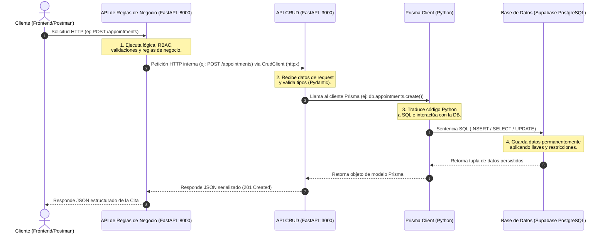

# 🦈 Arquitectura Desacoplada: SharkHub Barbershop

Este documento explica cómo funciona la "magia" detrás de la arquitectura de dos servidores independientes (descentralizados): el **Servidor de Reglas de Negocio** y el **Servidor CRUD de Base de Datos**, usando **FastAPI**, **Prisma ORM**, y **Supabase (PostgreSQL)**.

---

## 🏗️ 1. Entendiendo el Flujo General de la Arquitectura



### 🔹 Componentes del Flujo

1. **El Cliente (Frontend / Postman)**: Realiza peticiones a la API expuesta en el puerto `8000`. No tiene acceso directo a la base de datos ni a la API CRUD.
2. **API de Reglas de Negocio (Puerto 8000)**: En esta capa reside la inteligencia. Filtra quién puede hacer qué (Roles - RBAC), valida restricciones del dominio (disponibilidades, conflictos) y, si todo está correcto, llama a la API CRUD.
3. **API CRUD (Puerto 3000)**: Es un servidor puramente transaccional. Recibe peticiones HTTP locales, serializa las entradas, y utiliza el cliente ORM para realizar operaciones directas sobre PostgreSQL. No sabe nada de reglas de negocio, solo sabe hacer `INSERT`, `SELECT`, `UPDATE` y `DELETE`.
4. **Prisma ORM (Python Client)**: Mapea las tablas de la base de datos a objetos de Python autogenerados a partir del archivo de esquema `schema.prisma`. Traduce las sentencias del cliente Prisma (`db.public_users.create(...)`) a SQL nativo.
5. **Base de Datos (Supabase)**: Es el motor PostgreSQL que corre en la nube. Persiste los datos físicamente en tablas bajo diferentes esquemas (`auth` para seguridad y `public` para la aplicación).

---

## ⚡ 2. Detalle de las 3 Reglas de Negocio y sus Flujos Completos

A continuación se detallan 3 flujos completos para que tú y tus compañeros entiendan cómo se procesan las reglas, cómo se comunican las APIs y cómo interactúa el ORM.

---

### 🔥 Flujo 1: Creación de Citas con Validación de Horarios y Conflictos (`POST /appointments`)

Esta es la funcionalidad core de la barbería. No basta con insertar una cita; antes se deben validar tres reglas de negocio críticas.

#### Paso 1.1: Validación de Reglas en la API de Negocios
Cuando el cliente envía un `POST /appointments`, el endpoint en [appointment_controller.py (Negocios)](file:///c:/Users/andre/Desktop/ESPE/SEMESTRE%205/WEB%20AVANZADO/Group%20Repository/pandabwbarbershop_API_businessRules/app/controllers/appointment_controller.py#L142-L200) intercepta la petición y llama a la función `validate_appointment_rules`:

```python
# Ubicación: pandabwbarbershop_API_businessRules/app/controllers/appointment_controller.py
async def validate_appointment_rules(
    barbershop_id: str, barber_id: str, app_date: date, start_time: time, end_time: time
):
    # 1. Valida que el barbero esté activo en la barbería
    members = await crud_client.list_members(barbershop_id=barbershop_id, user_id=barber_id)
    if not members or members[0]["role"].upper() != "BARBER" or members[0]["status"] != "active":
        raise HTTPException(status_code=400, detail="El barbero no es un miembro activo.")

    # 2. Valida disponibilidad horaria (HU21)
    day_of_week = app_date.isoweekday() # Lunes = 1, Domingo = 7
    availabilities = await crud_client.list_availabilities(barber_id=barber_id, barbershop_id=barbershop_id)
    # Busca si el horario solicitado está dentro de su rango de trabajo (start_time >= av_start y end_time <= av_end)
    ...

    # 3. Evita colisiones de horario / Doble Reserva (HU28)
    existing_appointments = await crud_client.list_appointments(barber_id=barber_id, appointment_date=str(app_date))
    for app in existing_appointments:
        # Condición de colisión: start1 < end2 AND start2 < end1
        if start_time < parse_time_str(app["end_time"]) and parse_time_str(app["start_time"]) < end_time:
            raise HTTPException(status_code=400, detail="Conflicto de horario: El barbero ya tiene una cita.")
```

#### Paso 1.2: Envío de Petición HTTP a la API CRUD
Si las validaciones pasan, se llama al cliente HTTP `crud_client.create_appointment(...)` definido en [crud_client.py](file:///c:/Users/andre/Desktop/ESPE/SEMESTRE%205/WEB%20AVANZADO/Group%20Repository/pandabwbarbershop_API_businessRules/app/clients/crud_client.py#L160-L177):

```python
async def create_appointment(self, barbershop_id, client_id, barber_id, appointment_date, start_time, end_time, notes):
    data = {
        "barbershop_id": barbershop_id,
        "client_id": client_id,
        "barber_id": barber_id,
        "appointment_date": appointment_date,
        "start_time": start_time,
        "end_time": end_time,
        "notes": notes
    }
    return await self._request("POST", "/appointments", json=data)
```

#### Paso 1.3: Procesamiento en la API CRUD y Persistencia ORM
La API CRUD recibe la petición en [appointment_controller.py (CRUD)](file:///c:/Users/andre/Desktop/ESPE/SEMESTRE%205/WEB%20AVANZADO/Group%20Repository/pandabwbarbershop/app/controllers/appointment_controller.py#L54-L83) y realiza la persistencia utilizando Prisma:

```python
# Ubicación: pandabwbarbershop/app/controllers/appointment_controller.py
@router.post("", response_model=AppointmentResponse, status_code=201)
async def create_appointment(body: AppointmentCreate):
    # Convierte fechas y horas recibidas en objetos datetime
    date_dt = datetime.combine(body.appointment_date, datetime.min.time())
    start_dt = datetime.combine(date.min, body.start_time)
    end_dt = datetime.combine(date.min, body.end_time)

    # Llama a Prisma ORM para insertar en PostgreSQL
    new_appointment = await db.appointments.create(
        data={
            "id": str(uuid.uuid4()),
            "barbershop_id": body.barbershop_id,
            "client_id": body.client_id,
            "barber_id": body.barber_id,
            "appointment_date": date_dt,
            "start_time": start_dt,
            "end_time": end_dt,
            "status": "pending",
            "notes": body.notes
        }
    )
    return new_appointment
```

#### Paso 1.4: Mapeo del ORM en el Esquema Base
Prisma traduce esto utilizando el modelo definido en [schema.prisma](file:///c:/Users/andre/Desktop/ESPE/SEMESTRE%205/WEB%20AVANZADO/Group%20Repository/pandabwbarbershop/prisma/schema.prisma#L515-L534):
```prisma
model appointments {
  id               String       @id @default(dbgenerated("gen_random_uuid()")) @db.Uuid
  barbershop_id    String       @db.Uuid
  client_id        String       @db.Uuid
  barber_id        String       @db.Uuid
  appointment_date DateTime     @db.Date
  start_time       DateTime     @db.Time(6)
  end_time         DateTime     @db.Time(6)
  status           String?      @default("pending") @db.VarChar(20)
  notes            String?
  
  @@schema("public") // Indica que reside en el esquema "public" de PostgreSQL
}
```

---

### 🛡️ Flujo 2: Registro de Usuarios con Transacción Manual de Fallback (`POST /auth/register`)

Cuando un usuario nuevo se registra, debemos guardar información en dos esquemas de base de datos diferentes:
1. **Esquema `auth`**: Credenciales de inicio de sesión (email y contraseña hash).
2. **Esquema `public`**: Datos de perfil de usuario (nombre completo, teléfono, avatar).

Al estar descentralizado, si la creación del perfil público falla, debemos revertir (hacer rollback manual) el registro de credenciales para evitar cuentas rotas.

#### Paso 2.1: Lógica y Fallback en la API de Negocios
El controlador en [auth_controller.py (Negocios)](file:///c:/Users/andre/Desktop/ESPE/SEMESTRE%205/WEB%20AVANZADO/Group%20Repository/pandabwbarbershop_API_businessRules/app/controllers/auth_controller.py#L11-L53) procesa el flujo así:

```python
# Ubicación: pandabwbarbershop_API_businessRules/app/controllers/auth_controller.py
@router.post("/auth/register", status_code=201)
async def register(body: RegisterRequest):
    # 1. Verifica si el email ya existe
    existing = await crud_client.list_users(email=body.email)
    if existing:
        raise HTTPException(status_code=400, detail="El correo electrónico ya está registrado.")

    user_uuid = str(uuid.uuid4())
    hashed_pass = hash_password(body.password) # Encripta la contraseña usando bcrypt

    try:
        # 2. Crea las credenciales en el esquema de seguridad (auth_users)
        await crud_client.create_auth_user(id=user_uuid, email=body.email, encrypted_password=hashed_pass)
        
        # 3. Crea el perfil público del usuario (public_users)
        profile = await crud_client.create_user(id=user_uuid, full_name=body.name, email=body.email)
        
        return {"message": "Usuario registrado exitosamente", "user": profile}
        
    except Exception as e:
        # 🚨 ROLLBACK MANUAL: Si algo falla al crear el perfil, borramos el usuario creado en auth
        try:
            await crud_client.delete_auth_user(user_uuid)
        except Exception:
            pass
        raise HTTPException(status_code=500, detail=f"Error durante el registro: {str(e)}")
```

#### Paso 2.2: Persistencia mediante Prisma en la API CRUD
El ORM expone modelos separados para ambos esquemas. Prisma permite declarar múltiples esquemas de base de datos a través de la opción `previewFeatures = ["multiSchema"]` en [schema.prisma](file:///c:/Users/andre/Desktop/ESPE/SEMESTRE%205/WEB%20AVANZADO/Group%20Repository/pandabwbarbershop/prisma/schema.prisma#L3):

```prisma
// Ubicación: schema.prisma
datasource db {
  provider = "postgresql"
  url      = env("DATABASE_URL")
  schemas  = ["auth", "public"] // Base de datos multi-esquema
}

model auth_users {
  id                 String       @id @db.Uuid
  email              String?      @unique
  encrypted_password String?
  @@schema("auth")               // Vive en el esquema "auth"
}

model public_users {
  id        String      @id @db.Uuid
  full_name String?     @db.VarChar(120)
  email     String?     @unique @db.VarChar(120)
  @@map("users")            // En PostgreSQL la tabla física se llama "users"
  @@schema("public")          // Vive en el esquema "public"
}
```

El ORM mapea estas tablas permitiendo que en la API CRUD llamemos a:
- `db.auth_users.create(...)`
- `db.public_users.create(...)` (que escribe en la tabla `public.users`).

---

### 🎟️ Flujo 3: Generación de Códigos de Invitación para Barberos (`POST /barbershops/{shop_id}/invitations`)

Para que un barbero se una a una barbería, el dueño de dicho local debe generarle un código de invitación único. Este flujo combina validación de roles de acceso (RBAC) y generación automática de patrones de datos.

#### Paso 3.1: Control de Acceso y Formato de Código en la API de Negocios
El endpoint en [invitation_controller.py (Negocios)](file:///c:/Users/andre/Desktop/ESPE/SEMESTRE%205/WEB%20AVANZADO/Group%20Repository/pandabwbarbershop_API_businessRules/app/controllers/invitation_controller.py#L37-L61) procesa la solicitud:

```python
# Ubicación: pandabwbarbershop_API_businessRules/app/controllers/invitation_controller.py
def generate_invitation_code() -> str:
    # Genera un código aleatorio alfanumérico con formato: SH-982-XYZ
    p1 = "".join(random.choices(string.digits, k=3))
    p2 = "".join(random.choices(string.ascii_uppercase, k=3))
    return f"SH-{p1}-{p2}"

@router.post("/{shop_id}/invitations", status_code=201)
async def create_invitation(shop_id: str, body: InvitationCreate, current_user: dict = Depends(get_current_user)):
    # 🔒 REGLA DE NEGOCIO (RBAC): Valida si el usuario logueado es el dueño (Owner) de la barbería
    await check_is_barbershop_owner(current_user["id"], shop_id)

    # Genera el código
    code = generate_invitation_code()
    expires_str = body.expires_at.isoformat() if body.expires_at else None

    # Llama al CRUD para persistirlo
    new_code = await crud_client.create_invitation_code(
        barbershop_id=shop_id,
        code=code,
        expires_at=expires_str,
        is_active=True
    )
    return new_code
```

#### Paso 3.2: Validación del Propietario (RBAC)
La función helper `check_is_barbershop_owner` valida los privilegios del solicitante antes de autorizar la escritura:
```python
async def check_is_barbershop_owner(user_id: str, barbershop_id: str):
    # Consulta a la base de datos si el usuario tiene membresía con rol 'OWNER' y estatus 'active'
    memberships = await crud_client.list_members(barbershop_id=barbershop_id, user_id=user_id)
    if not memberships or not any(m["role"].upper() == "OWNER" for m in memberships):
        raise HTTPException(
            status_code=403,
            detail="Restricción: Solo el Propietario (Owner) puede realizar esta acción."
        )
```

#### Paso 3.3: Mapeo y Persistencia en la Base de Datos
El modelo de base de datos se declara en el archivo de Prisma [schema.prisma](file:///c:/Users/andre/Desktop/ESPE/SEMESTRE%205/WEB%20AVANZADO/Group%20Repository/pandabwbarbershop/prisma/schema.prisma#L595-L605):

```prisma
model invitation_codes {
  id            String      @id @default(dbgenerated("gen_random_uuid()")) @db.Uuid
  barbershop_id String      @db.Uuid
  code          String      @unique @db.VarChar(20)
  expires_at    DateTime?   @db.Timestamptz(6)
  is_active     Boolean?    @default(true)
  created_at    DateTime?   @default(now()) @db.Timestamptz(6)
  barbershops   barbershops @relation(fields: [barbershop_id], references: [id], onDelete: Cascade, onUpdate: NoAction)

  @@schema("public")
}
```
Cuando la base de datos ejecuta el `INSERT`, valida la restricción `@unique` de la columna `code`. Si el código generado colisionara con uno existente, PostgreSQL levantará un error de integridad, protegiendo los datos.

---

## 💡 Resumen para el Deber de la clase

Para cumplir con el deber de **"hacer una sola URI que funcione"** y explicarle a tu profesor y compañeros:

1. **La URI de Entrada**: El cliente interactúa con la URI de Negocios en el puerto 8000:
   `POST http://localhost:8000/appointments`
2. **La Lógica de Negocio**: Valida que no haya choques de horario ni barberos inactivos (en FastAPI).
3. **El Puente Descentralizado**: Se comunica por detrás en red interna con el CRUD en el puerto 3000:
   `POST http://localhost:3000/appointments`
4. **La Persistencia**: La API CRUD usa **Prisma ORM** (`db.appointments.create`) para guardar la cita en **PostgreSQL (Supabase)**, mapeando el modelo en el archivo [schema.prisma](file:///c:/Users/andre/Desktop/ESPE/SEMESTRE%205/WEB%20AVANZADO/Group%20Repository/pandabwbarbershop/prisma/schema.prisma).

¡Con esto tienen el flujo completo de cómo se realiza la magia en un microservicio de manera limpia y escalable!
